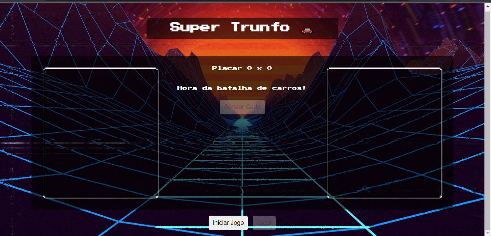
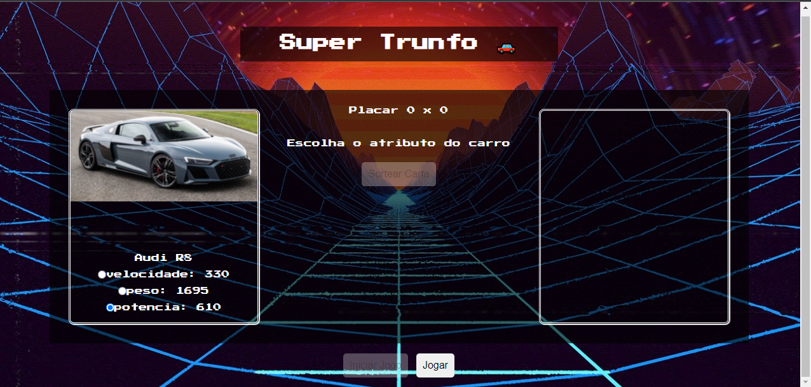
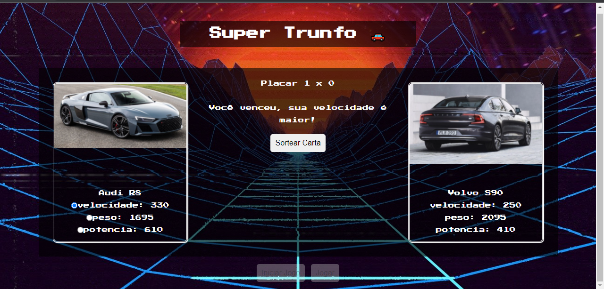
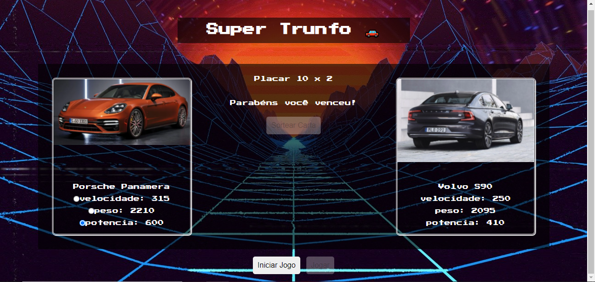

# Super-Trunfo

O desafio consiste em criar o jogo de cartas super trunfo, que coloca duas cartas diferentes com atributos para batalhar, dependendo do atributo, vence a carta que tiver o maior valor. Como bônus o jogo ainda é responsivo se adaptando a maioria dos tamanhos de tela.

## 🔧 Funçoes 

### Iniciar Jogo:
Ao clicar no botão "Iniciar Jogo" é sorteada uma carta para o jogador e uma para a máquina, porém só a carta do jogador e seus atributos é exibida ao usuário, deixando o botão de "Iniciar Jogo" desabilitado e habilitando o botão "Jogar".

### Jogar:
Para jogar basta selecionar um dos três atributos da carta, caso o usuário não selecione nenhum a carta já deixa um selecionado, e clicar no botão "Jogar" que logo em seguida será desabilitado, além de alterar o placar e mostrar se o usuário venceu, perdeu ou empatou, habilitando o botão "Sortear Carta".

### Sortear Carta:
Ao clicar em "Sortear Carta" o botão é desabilitado, habilitando o botão "Jogar", limpando a carta da máquina e mostrando somente a nova carta do usuário e seus atributos. Quando a máquina ou jogador atingir 10 pontos no placar o jogo informa o vencedor, deixando apenas o botão "Iniciar Jogo" habilitado para que um novo jogo seja iniciado.

## Feito Com:

Copyright © DavidWillian

